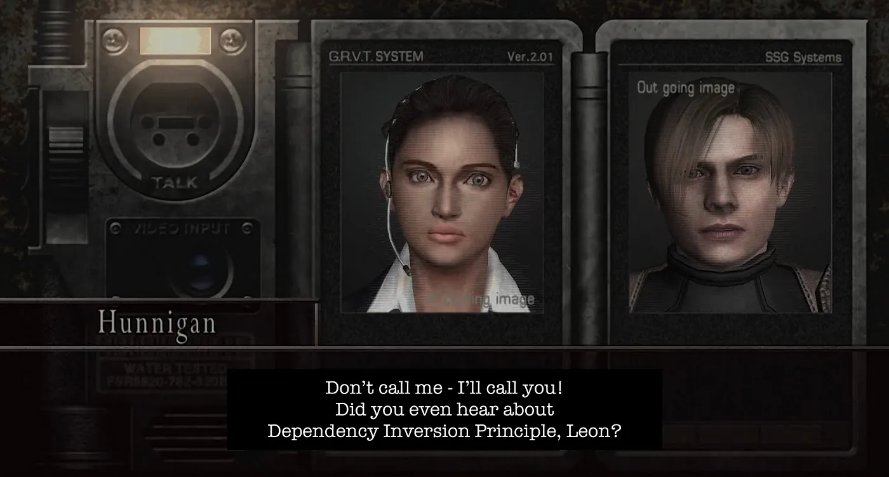

# 🎮 Design Patterns in Python – Resident Evil 4 Inspired

This repo contains Python examples of popular design patterns, all themed around the game *Resident Evil 4*.

I created these examples for my [Medium article](https://medium.com/@graveetone/design-patterns-under-pythons-umbrella-️-651d18f04312), where I explain how each pattern works using characters and situations from the game.

